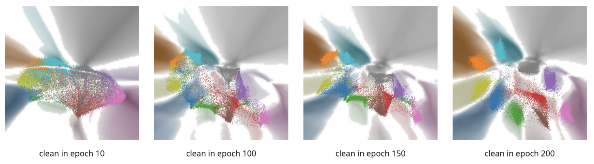
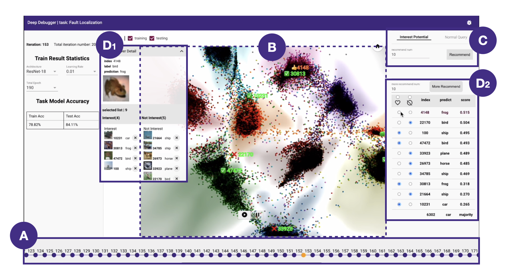

# Training Dynamic Visualization
Training Dynamic Visualization, a technique designed to visualize high-dimensional representations during the deep learning training process. In other words, our method is designed to transform the model training dynamics into an animation of canvas with colorful dots and territories.



# How to Use it?

## Pull Our Code
```
git clone https://github.com/code-philia/time-travelling-visualizer.git
```

The project structure looks as follow:
```
time-travelling-visualizer
│   README.md
|
└───training_dynamic
│   │   README.md
    
│   
└───Vis
|   │   singleVis | ...
|   │   trustvis  | ...
|   │   subject_model_eval.py
|   │   trustvis_tempo.py 
|   │   requirements.txt
|   
│   
└───VisTool
│   │   Backend
│   |   |    ...
│   |   |    server
│   |   |    |   server.py
│   |   |    ...
│   │   Frontend
│   |   |    ...
│   |   |    tensorboard
│   |   |    |   projector | ...
│   |   |    ...
└───
```

- training_dynamic fold is for storing the dataset
- Vis fold is for training the visualization models
- visTool fold is the interactive visualization tool's backend and frontend

⚠️ Note that, the training_dynamic folder stores the training process and the target dataset. 

# Environment Configuration
1. create conda environment
```
$ conda create -n visualizer python=3.7
$ (visualizer) conda activate visualizer
```

2. install pyTorch and CUDA
For setting up PyTorch on that conda environment, use the guidelines provided at [PyTorch's official local installation page](https://pytorch.org/get-started/locally/). This guide will help you select the appropriate configuration based on your operating system, package manager, Python version, and CUDA version.

3. install requirements

For linux developers, you can use the following command to install the required packages.
```
$ (visualizer) pip install -r requirements.txt
```
For windows developers, you can use the following command instead.
```
$ (visualizer) pip install -r win-requirements.txt
```

Note that, if you are using VPN or other proxy, please specify `--proxy` parameter to install the packages.

## Training Process Dataset (the training process of a model)


You can train your classification model and save the training dynamics. For information on the structure of the training dynamics directory and the config file format, refer to the the [dataset's readme document](./training_dynamic/README.md).

🍃 Training dynamics examples are also available on [Hugging Face](https://huggingface.co/datasets/code-philia/mtpnet) for you to download. 

1. download training dynamics example from huggingface
```
$ cd training_dynamic
$ git lfs clone https://huggingface.co/datasets/code-philia/mtpnet.git
$ unzip mtpnet/case_study_mnist_backdoor.zip
```
2. unzip the dataset file

For linux user, you can unzip the example dataset into training_dynamic directory using the command
```
$ unzip mtpnet/case_study_mnist_backdoor.zip
```
For windows user, you can unzip the example dataset into training_dynamic directory using the command
```
$ Expand-Archive mtpnet/case_study_mnist_backdoor.zip -DestinationPath .
```

With this provided example, you can directly experience our tool.

If you want to train your own visualization model, refer to the the [visualization model's readme document](./Vis/README.md).

# Run interactive Visualizer Tool
```
$ cd /Tool/server
$ conda activate visualizer
$ (visualizer) ./start_server.sh 
```
Windows users can use the following command instead to run the tool
```
$ (visualizer) python server.py
```
you will see: 
```
Starting milvus-minio ... done
Starting milvus-etcd  ... done
Starting milvus-standalone ... done
* Serving Flask app 'server' (lazy loading)
* Environment: production
* Debug mode: off
* Running on http://ip:port

Access the user interface by opening http://ip:port in your web browser.
```




---


# Citation

```
@inproceedings{yang2023deepdebugger,
  title={DeepDebugger: An Interactive Time-Travelling Debugging Approach for Deep Classifiers},
  author={Yang, Xianglin and Lin, Yun and Zhang, Yifan and Huang, Linpeng and Dong, Jin Song and Mei, Hong},
  booktitle={Proceedings of the 31st ACM Joint European Software Engineering Conference and Symposium on the Foundations of Software Engineering},
  pages={973--985},
  year={2023}
}


@inproceedings{yang2022temporality,
  title={Temporality Spatialization: A Scalable and Faithful Time-Travelling Visualization for Deep Classifier Training},
  author={Yang, Xianglin and Lin, Yun and Liu, Ruofan and Dong, Jin Song},
  booktitle = {Proceedings of the Thirty-First International Joint Conference on Artificial Intelligence, {IJCAI-22}},
  year={2022}
}

@inproceedings{yang2022deepvisualinsight,
  title={DeepVisualInsight: Time-Travelling Visualization for Spatio-Temporal Causality of Deep Classification Training},
  author={Yang, Xianglin and Lin, Yun and Liu, Ruofan and He, Zhenfeng and Wang, Chao and Dong, Jin Song and Mei, Hong},
  booktitle = {The Thirty-Sixth AAAI Conference on Artificial Intelligence (AAAI)},
  year={2022}
}
```

## Acknowledgement
We appreciate all our collaborators for their contributions in this project:

Xianglin Yang, Ruofan Liu, Guorui Qin, ... (the list is expanding)

