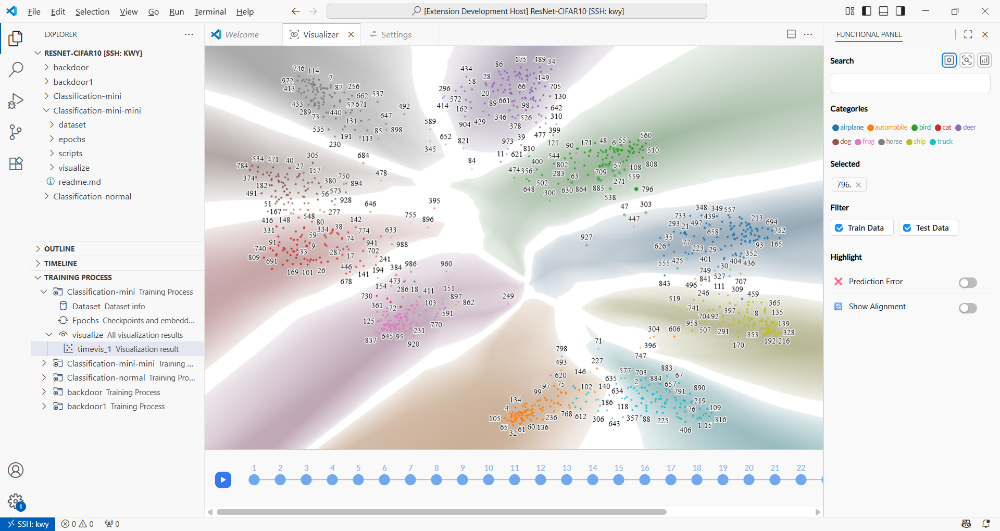
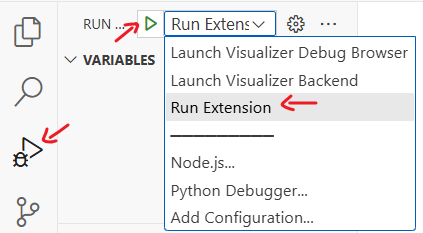

# Time-Travelling Visualizer 🚀

> A VS Code extension for visualizing and debugging the training process of machine learning models.


## ✨ Features

*   **Training Visualization**: Visualize the training process through dimensionality reduction.
*   **Time-Travelling Debugging**: Step through training events to understand model behavior over time. 
*   **Influence Analysis**: Inspect influence functions to see how training data affects predictions. 
*   **Interactive Tools**: Exploring the Representation Space with Multiple Functions. 




## 🛠️ Setup & Launch

1.  **Setup Environment**

    *   **Backend (Python)**:
        Run the setup script below (make sure you have installed Anaconda or Miniconda):
        ```bash
        bash setup.sh
        ```
        This will create a Python 3.10 environment named "visualizer" and install the required dependencies.

    *   **Frontend (Node.js)**:
        We assume you have Node.js installed. Navigate to the `web` and `extension` directories to install the dependencies:
        ```bash
        # Install web dependencies
        cd web
        npm install
        cd ..

        # Install extension dependencies
        cd extension
        npm install
        ```

2.  **Launch**

    *   **Backend Server**:
        1.  Open a terminal and navigate to the project root directory.
        2.  Activate the Conda environment:
            ```bash
            conda activate visualizer
            ```
        3.  Start the backend server:
            ```bash
            cd tool/server
            python server.py
            ```
    *   **Frontend (Run Extension)**:
        1.  Open the project root directory In VS Code, press `Ctrl+Shift+D` or click the "Run and Debug" icon in the sidebar.
        2.  Select the "Run Extension" configuration from the dropdown menu.
        3.  Press `F5` or click the "Start Debugging" button.
        4.  This will open a new "Extension Development Host" window where the extension is running.
        

💭 This is only a temporary way to start up the extension; the final version will switch to a regular VSCode extension that can be imported and used directly. For detailed usage instructions, see [Doc for time-travelling-visualizer](https://code-philia.github.io/time-travelling-visualizer/extension/home/).


## 📁 Project Structure

```
.
├── extension/    # 📦 VS Code Extension Source Code
├── tool/         # 🐍 Python Backend & Visualization Methods
├── web/          # 🌐 Frontend Web Application (Loaded In Extension)
├── setup.sh      # 🚀 Setup Script
└── README.md
```


## 🚀 Future Improvements

1.  **Code Refactoring**:
    *   Decouple various visualization algorithm modules.
    *   Elegantly encapsulate the communication between the extension, web page, and backend.
    *   Refactor and resolve code smells.
2.  **Broader Task Compatibility**:
    *   Extend support to more training tasks, such as generative and contrastive learning tasks.
3.  **Features in Development**:
    *   The **Token Panel** and **Influence Function** features are currently under development.

---
